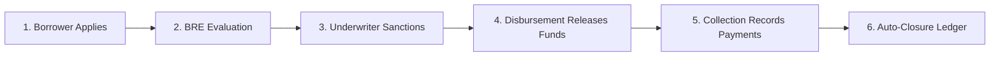
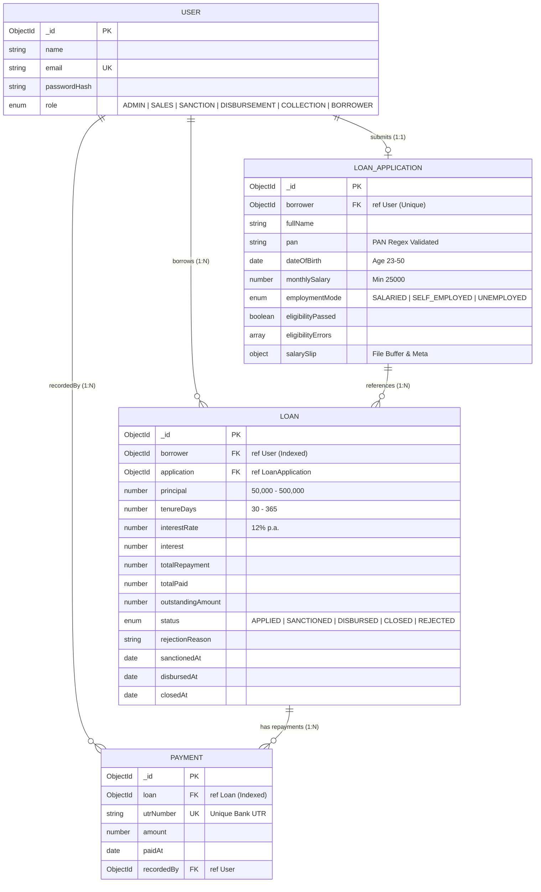

# 🏦 Enterprise Loan Management System (LMS)

[](https://www.typescriptlang.org/)
[](https://nextjs.org/)
[](https://nodejs.org/)
[](https://expressjs.com/)
[](https://www.mongodb.com/)
[](https://tailwindcss.com/)
[](https://www.docker.com/)
[](https://www.postman.com/)

An enterprise-grade, full-stack **Loan Management System (LMS)** designed for digital lending operations. The platform provides an end-to-end workflow from borrower onboarding and automated Business Rule Engine (BRE) underwriting to loan sanctioning, fund disbursement, repayment collection, and ledger-based auto-closure.

---

## 📑 Table of Contents

1. [Live Product Walkthrough & Deployment](#-live-product-walkthrough--deployment)
2. [Key Features & Capabilities](#-key-features--capabilities)
3. [Tech Stack Architecture](#-tech-stack-architecture)
4. [System Prerequisites](#-system-prerequisites)
5. [Step-by-Step Setup Guide](#-step-by-step-setup-guide)
6. [Evaluator Demo Credentials](#-evaluator-demo-credentials)
7. [Complete End-to-End Review Walkthrough](#-complete-end-to-end-review-walkthrough)
8. [Database Architecture & ERD](#-database-architecture--erd)
9. [API Endpoints Reference](#-api-endpoints-reference)
10. [Postman Collection & API Testing](#-postman-collection--api-testing)
11. [Business Rules Engine (BRE) & Financial Formulas](#-business-rules-engine-bre--financial-formulas)
12. [Project Directory Layout](#-project-directory-layout)
13. [Build & Verification](#-build--verification)

---

## 🎬 Live Product Walkthrough & Deployment

- **Live Application**: <a href="https://lms-frontend-iyu8.onrender.com" target="_blank" rel="noopener noreferrer">https://lms-frontend-iyu8.onrender.com</a>
- **Video Walkthrough**: <a href="https://drive.google.com/file/d/1IXXcOU3P6eP3X1Rf_tMjVWZtX9iiE64X/view?usp=sharing" target="_blank" rel="noopener noreferrer">https://drive.google.com/file/d/1IXXcOU3P6eP3X1Rf_tMjVWZtX9iiE64X/view?usp=sharing</a>
- **Workflow Highlights**:
  - Full RBAC authentication (`ADMIN`, `SALES`, `SANCTION`, `DISBURSEMENT`, `COLLECTION`, `BORROWER`).
  - Borrower Onboarding with live Business Rule Engine (BRE) validation & salary slip upload.
  - Operations Command Center with real-time portfolio analytics & live activity audit stream.
  - Credit underwriting workflow (Sanction / Rejection), Operations fund disbursement, and UTR collection with auto-closure.

---

## 🌟 Key Features & Capabilities

### 1. Multi-Role RBAC (Role-Based Access Control)
- **6 Discrete Personas**: `ADMIN`, `SALES`, `SANCTION`, `DISBURSEMENT`, `COLLECTION`, and `BORROWER`.
- **Dual-Layer Enforcement**: Enforced both on the frontend UI (via route guards and navigation filters) and on the backend API (via JWT RBAC middleware with HTTP `403 Forbidden` barriers).

### 2. Intelligent Business Rule Engine (BRE)
- **Deterministic Evaluation**: Evaluates applicant eligibility against hard financial parameters (Age 23–50, Minimum Salary ₹25,000/mo, strict Indian PAN regex format, and non-unemployed status).
- **Graceful Error Aggregation**: Collects and returns exact violation reasons to guide applicants without exposing internal business secrets.

### 3. Real-Time Operations Pipeline Visualizer
- **Stage Progression Flow**: APPLIED $\rightarrow$ SANCTIONED $\rightarrow$ DISBURSED $\rightarrow$ CLOSED (or REJECTED).
- **Interactive Micro-Animations**: Synchronized pulse, animated glow particles, soft-tinted status cards, and responsive state indicators.

### 4. Financial Calculation Engine
- **Accurate Simple Interest Formula**:
  $$\text{Interest} = \frac{\text{Principal} \times \text{Rate} \times \text{Tenure (Days)}}{365 \times 100}$$
- **Real-Time Term Slider**: Instantly recalibrates tenure (30–365 days) and principal (₹50,000–₹500,000) with dynamic repayment liability projection.

### 5. Document Handling & Security
- **Multer Middleware**: Validates salary slip uploads against strict MIME types (`application/pdf`, `image/png`, `image/jpeg`) and 5MB size caps.
- **Dual Persistence**: Persists files to local disk storage while retaining binary buffers in MongoDB for resilient retrieval.

### 6. Ledger Repayments & Auto-Closure
- **UTR Deduplication**: Every repayment requires a unique Bank UTR number enforced by MongoDB unique indexes.
- **Automated Lifecycle Trigger**: Once cumulative repayments satisfy the total loan liability (`outstandingAmount == 0`), the loan status automatically transitions to `CLOSED`.

---

## 🏗️ Tech Stack Architecture

| Layer | Technologies | Description |
| :--- | :--- | :--- |
| **Frontend** | Next.js 15 (App Router), React 19, TypeScript | Server & Client Components, Responsive UI |
| **Styling** | Tailwind CSS 3.4, Lucide Icons | Custom design system, responsive glassmorphism |
| **Backend API**| Node.js 20+, Express.js 4.21, TypeScript | RESTful API, Modular Controller-Service architecture |
| **Database** | MongoDB 7.0, Mongoose 8.9 | Indexed document store with schema validation |
| **Auth & Security** | JWT (`jsonwebtoken`), `bcryptjs`, `cors` | Stateless bearer token auth with salt rounds |
| **File Processing**| Multer | Multipart/form-data parser for salary slip proofs |
| **DevOps & QA** | Docker Compose, Postman v2.1.0 Collection | Containerized DB setup and end-to-end API automation |

---

## 📋 System Prerequisites

Before running the project locally, ensure you have the following installed:

- **Node.js**: `v18.18.0` or `v20.x+` ([Download Node.js](https://nodejs.org/))
- **npm**: `v9.x` or `v10.x+` (comes bundled with Node.js)
- **MongoDB**: Local MongoDB Community Server running on port `27017` **OR** [Docker Desktop](https://www.docker.com/products/docker-desktop/)
- *(Optional)* **MongoDB Compass**: For inspecting MongoDB database collections ([Download Compass](https://www.mongodb.com/try/download/compass))
- *(Optional)* **Postman**: For API testing ([Download Postman](https://www.postman.com/downloads/))

---

## 🚀 Step-by-Step Setup Guide

### Step 1: Install Dependencies
Open your terminal in the root directory and install all monorepo workspace dependencies:

```bash
npm install
```

---

### Step 2: Configure Environment Variables

Create the `.env` file for the **backend**:
```bash
# Windows PowerShell
Copy-Item backend/.env.example backend/.env

# macOS / Linux
cp backend/.env.example backend/.env
```

Create the `.env.local` file for the **frontend**:
```bash
# Windows PowerShell
Copy-Item frontend/.env.example frontend/.env.local

# macOS / Linux
cp frontend/.env.example frontend/.env.local
```

#### Environment Variables Reference:

**Backend (`backend/.env`):**
```env
NODE_ENV=development
PORT=4000
MONGODB_URI=mongodb://127.0.0.1:27017/credit-sea-lms
JWT_SECRET=creditsea-super-secure-jwt-secret-key-2026
JWT_EXPIRES_IN=7d
CLIENT_ORIGINS=http://localhost:3000,http://localhost:3001
```

**Frontend (`frontend/.env.local`):**
```env
NEXT_PUBLIC_API_BASE_URL=http://localhost:4000/api
```

---

### Step 3: Start MongoDB

#### Option A: Using Docker (Recommended)
If you have Docker Desktop installed, start a containerized MongoDB instance with one command:
```bash
npm run mongo:up
```
*(To shut down the container later, run `npm run mongo:down`)*

#### Option B: Using Local MongoDB Service
Ensure your local MongoDB service is running on `mongodb://127.0.0.1:27017`.

---

### Step 4: Seed the Database
Populate the database with pre-configured users for all 6 roles:

```bash
npm run seed
```

Output:
```text
Seeded ADMIN: admin@lms.test / Password@123
Seeded SALES: sales@lms.test / Password@123
Seeded SANCTION: sanction@lms.test / Password@123
Seeded DISBURSEMENT: disbursement@lms.test / Password@123
Seeded COLLECTION: collection@lms.test / Password@123
Seeded BORROWER: borrower@lms.test / Password@123
```

---

### Step 5: Launch Development Servers

You can launch both services using separate terminal windows:

**Terminal 1 (Backend API):**
```bash
npm run dev:backend
```
> Backend starts at: `http://localhost:4000` (Health check: `http://localhost:4000/health`)

**Terminal 2 (Frontend App):**
```bash
npm run dev:frontend
```
> Frontend starts at: `http://localhost:3000`

---

## 👥 Evaluator Demo Credentials

All seeded accounts share the default test password: **`Password@123`**

| Role | Email Address | Accessible Portal / Views | Evaluation Highlights to Test |
| :--- | :--- | :--- | :--- |
| **👑 Admin** | `admin@lms.test` | Full Access (`/dashboard/*`) | Executive analytics, cross-department loan monitoring |
| **💼 Sales** | `sales@lms.test` | Sales Leads (`/dashboard/sales`) | Leads stream, registered users without active applications |
| **⚖️ Sanction** | `sanction@lms.test` | Underwriting (`/dashboard/sanction`) | Review applied loans, examine salary slip, Approve / Reject |
| **💸 Disbursement** | `disbursement@lms.test` | Fund Transfer (`/dashboard/disbursement`) | Process sanctioned loans, trigger disbursement timestamp |
| **💰 Collection** | `collection@lms.test` | Recovery (`/dashboard/collection`) | Record installment payments with Bank UTR, verify auto-closure |
| **👤 Borrower** | `borrower@lms.test` | Borrower Portal (`/borrower`) | Multi-step KYC, BRE engine checks, loan terms selection |

---

## 🔍 Complete End-to-End Review Walkthrough

Follow this 5-phase sequence to evaluate the entire system lifecycle:



### Phase 1: Test Borrower Application & BRE Engine
1. Navigate to `http://localhost:3000/login` and log in with `borrower@lms.test` / `Password@123`.
2. **Step 1 (KYC & BRE Validation)**:
   - *Test BRE Failure*: Enter Age < 23 (e.g., DOB `2010-01-01`) or Salary < ₹25,000 $\rightarrow$ Notice immediate server-side validation error banner.
   - *Pass BRE*: Enter valid details (DOB: `1995-05-15`, Monthly Salary: `65000`, PAN: `ABCDE1234F`, Employment: `SALARIED`).
3. **Step 2 (Salary Slip Proof)**:
   - Upload any test PDF, PNG, or JPG document under 5MB.
4. **Step 3 (Loan Terms Selection)**:
   - Adjust principal slider to ₹200,000 and tenure to 180 days.
   - Click **Submit Loan Application**. The loan is created with status `APPLIED`.

### Phase 2: Test Underwriting & Sanction Review
1. Log out and log in as `sanction@lms.test` / `Password@123`.
2. Navigate to **Sanction Review** (`/dashboard/sanction`).
3. Inspect the loan application details, applicant PAN, salary, and uploaded salary slip.
4. Click **Approve & Sanction Loan**. Status updates to `SANCTIONED`.

### Phase 3: Test Operations Fund Disbursement
1. Log in as `disbursement@lms.test` / `Password@123`.
2. Navigate to **Disbursement Queue** (`/dashboard/disbursement`).
3. Click **Confirm Disbursement**. Status updates to `DISBURSED` with timestamp recorded.

### Phase 4: Test Repayments & Auto-Closure
1. Log in as `collection@lms.test` / `Password@123`.
2. Navigate to **Collections Ledger** (`/dashboard/collection`).
3. Click **Record Payment**:
   - Enter Bank UTR (e.g., `UTR987654321`) and partial payment amount (e.g., `50000`). Outstanding balance reduces in real-time.
   - Record remaining balance in full $\rightarrow$ Notice status instantly switches to `CLOSED`.

### Phase 5: Direct Database Verification (MongoDB Compass)
1. Open MongoDB Compass and connect to `mongodb://127.0.0.1:27017`.
2. Open database `credit-sea-lms`.
3. Verify documents in `users`, `loanapplications`, `loans`, and `payments`.

---

## 🗄️ Database Architecture & ERD

The system is built on 4 core MongoDB collections linked by `ObjectId` references. Detailed schema specifications and indexing strategies are documented in [**docs/ERD.md**](docs/ERD.md).



---

## 🔌 API Endpoints Reference

All endpoints are prefixed with `/api` and run on `http://localhost:4000`:

| Module | Method | Endpoint | Access Control | Description |
| :--- | :---: | :--- | :--- | :--- |
| **Auth** | `POST` | `/api/auth/register` | Public | Register new borrower |
| **Auth** | `POST` | `/api/auth/login` | Public | Authenticate user & issue JWT |
| **Auth** | `GET` | `/api/auth/me` | Authenticated | Fetch active user session profile |
| **Borrower** | `POST` | `/api/borrower/personal-details` | `BORROWER` | Submit KYC & trigger BRE check |
| **Borrower** | `POST` | `/api/borrower/salary-slip` | `BORROWER` | Upload salary slip proof (Multer) |
| **Borrower** | `POST` | `/api/borrower/loans` | `BORROWER` | Configure terms & submit loan |
| **Borrower** | `GET` | `/api/borrower/loans` | `BORROWER` | Fetch borrower's loan status & ledger |
| **Sales** | `GET` | `/api/dashboard/sales/leads` | `ADMIN`, `SALES` | Fetch registered leads without loans |
| **Sanction** | `GET` | `/api/dashboard/sanction/loans` | `ADMIN`, `SANCTION` | View all loans awaiting underwriting |
| **Sanction** | `PATCH`| `/api/dashboard/sanction/loans/:id/approve` | `ADMIN`, `SANCTION` | Approve & sanction loan |
| **Sanction** | `PATCH`| `/api/dashboard/sanction/loans/:id/reject` | `ADMIN`, `SANCTION` | Reject loan with reason |
| **Disbursement**| `GET` | `/api/dashboard/disbursement/loans` | `ADMIN`, `DISBURSEMENT`| List sanctioned loans awaiting payout |
| **Disbursement**| `PATCH`| `/api/dashboard/disbursement/loans/:id/disburse` | `ADMIN`, `DISBURSEMENT`| Mark loan as disbursed |
| **Collection** | `GET` | `/api/dashboard/collection/loans` | `ADMIN`, `COLLECTION` | List active loans requiring recovery |
| **Collection** | `POST` | `/api/dashboard/collection/loans/:id/payments` | `ADMIN`, `COLLECTION` | Record repayment with Bank UTR |

---

## 🧪 Postman Collection & API Testing

A complete Postman Collection (v2.1.0) with automated token extraction is provided in the repository:

- **Collection File**: [`docs/postman_collection.json`](docs/postman_collection.json)
- **Step-by-Step Testing Guide**: [**docs/POSTMAN_GUIDE.md**](docs/POSTMAN_GUIDE.md)

### Quick Import:
1. Open Postman $\rightarrow$ Click **Import** $\rightarrow$ Select `docs/postman_collection.json`.
2. Variable `{{baseUrl}}` is pre-configured to `http://localhost:4000`.
3. When you run any `Login` request, Postman automatically extracts and sets `{{authToken}}` in your environment.

---

## 📐 Business Rules Engine (BRE) & Financial Formulas

### Eligibility Criteria
1. **Age**: Applicant must be between **23 and 50 years** old:
   $$\text{Age} = \frac{\text{CurrentDate} - \text{DOB}}{365.25 \times 24 \times 3600 \times 1000}$$
2. **Monthly Salary**: Must be at least **₹25,000 / month**.
3. **PAN Number**: Strict Indian Income Tax PAN regex:
   ```regex
   ^[A-Z]{5}[0-9]{4}[A-Z]$
   ```
4. **Employment Mode**: Must be `SALARIED` or `SELF_EMPLOYED` (`UNEMPLOYED` is rejected).

### Financial Math
- **Interest Rate**: Fixed at $12\%$ per annum ($R = 12$).
- **Simple Interest ($SI$)**:
  $$SI = \frac{P \times 12 \times T}{365 \times 100}$$
- **Total Repayment ($A$)**:
  $$A = P + SI$$
- **Outstanding Balance**:
  $$\text{Outstanding} = A - \sum \text{Payments}$$

---

## 📂 Project Directory Layout

```text
.
|-- backend
|   |-- src
|   |   |-- config          # MongoDB connection & environment loader
|   |   |-- controllers     # Request handlers (auth, borrower, dashboard)
|   |   |-- middleware      # JWT auth, RBAC guards, multer upload handler
|   |   |-- models          # Mongoose schemas (User, Loan, LoanApplication, Payment)
|   |   |-- routes          # Express route definitions
|   |   |-- scripts         # DB seed script
|   |   |-- services        # Business Rule Engine (BRE) & calculation service
|   |   |-- types           # TypeScript interfaces & type definitions
|   |   `-- utils           # API response helpers & custom error classes
|   |-- uploads             # Local disk storage for uploaded salary slips
|   |-- .env.example        # Backend environment template
|   `-- tsconfig.json
|-- frontend
|   |-- src
|   |   |-- app             # Next.js App Router pages (/login, /borrower, /dashboard/*)
|   |   |-- components      # Reusable UI widgets, navigation bars, stat cards
|   |   `-- lib             # API client, auth context, TypeScript helpers
|   |-- public              # Static assets & icons
|   |-- .env.example        # Frontend environment template
|   `-- tailwind.config.ts  # Tailwind CSS theme configuration
|-- docs
|   |-- ERD.md              # Detailed Database Architecture & ERD specifications
|   |-- POSTMAN_GUIDE.md    # Complete Postman API testing guide
|   `-- postman_collection.json # Postman v2.1.0 Collection file
|-- docker-compose.yml      # Containerized MongoDB service
|-- package.json            # Monorepo workspace configuration
`-- README.md               # Master project documentation
```

---

## ✅ Build & Verification

To verify that all TypeScript types, Next.js page generation, and backend builds compile cleanly without errors:

```bash
npm run build
```

**Build Status**:
- Backend TypeScript compilation: **PASS** (`tsc -p tsconfig.json`)
- Frontend Next.js production build: **PASS** (`next build`)
- Static page generation: **14/14 pages compiled**
