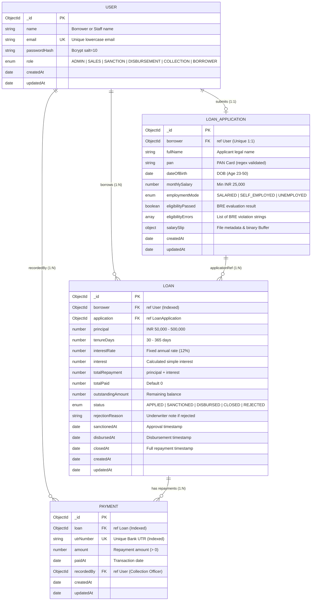
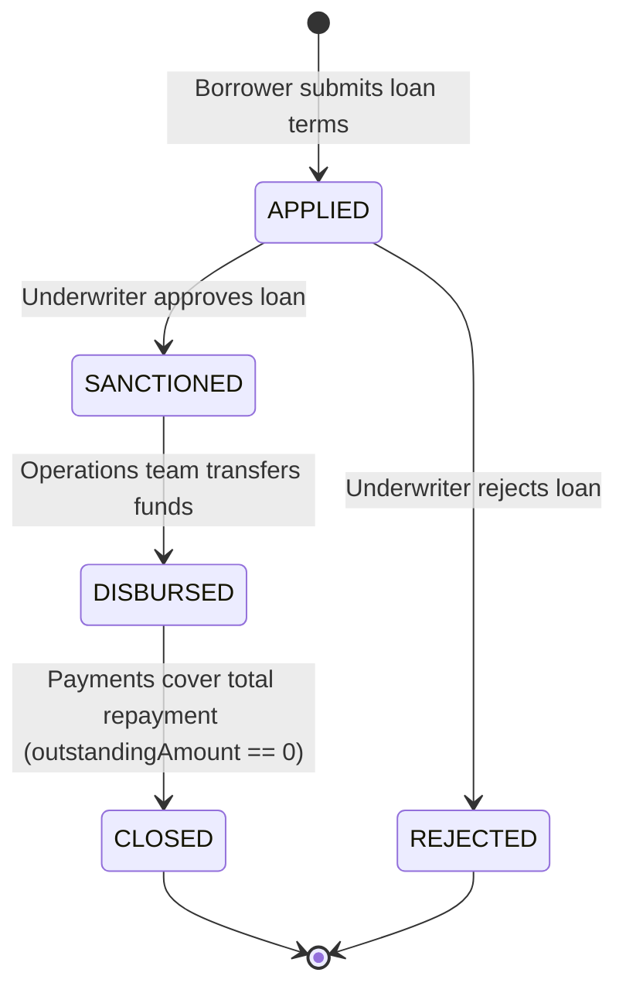

# Database Architecture & Entity-Relationship Diagram (ERD)

This document provides a comprehensive overview of the MongoDB data models, collection schemas, relationships, indexing strategies, and lifecycle states in the **Loan Management System (LMS)**.

---

## 1. Visual Entity-Relationship Diagram (ERD)

The diagram below maps all collections and their inter-document reference relationships:



---

## 2. Collection Schema Specifications

### `users` Collection
Stores authentication profiles and role permissions.

| Field | Type | Required | Constraints / Default | Description |
| :--- | :--- | :---: | :--- | :--- |
| `_id` | `ObjectId` | Yes | Auto-generated PK | Unique user identifier |
| `name` | `String` | Yes | Trimmed | User's full display name |
| `email` | `String` | Yes | **Unique**, Lowercase, Trimmed | Login identifier |
| `passwordHash` | `String` | Yes | Bcrypt Hash | Password hashed with salt rounds |
| `role` | `String` | Yes | Enum: `ADMIN`, `SALES`, `SANCTION`, `DISBURSEMENT`, `COLLECTION`, `BORROWER` | Role for RBAC authorization |
| `createdAt` | `Date` | Auto | Mongoose Timestamp | Account registration timestamp |
| `updatedAt` | `Date` | Auto | Mongoose Timestamp | Last profile update timestamp |

---

### `loanapplications` Collection
Stores borrower onboarding data, KYC attributes, salary proof, and BRE results.

| Field | Type | Required | Constraints / Default | Description |
| :--- | :--- | :---: | :--- | :--- |
| `_id` | `ObjectId` | Yes | Auto-generated PK | Unique application ID |
| `borrower` | `ObjectId` | Yes | **Unique Index**, Ref: `User` | 1-to-1 linkage to Borrower |
| `fullName` | `String` | Yes | Trimmed | Official applicant name |
| `pan` | `String` | Yes | Uppercase, Pattern: `^[A-Z]{5}[0-9]{4}[A-Z]$` | Indian PAN number |
| `dateOfBirth` | `Date` | Yes | Evaluated for age (23–50) | Applicant date of birth |
| `monthlySalary`| `Number` | Yes | `min: 0` (BRE requires $\ge 25,000$) | Monthly net income in INR |
| `employmentMode`| `String`| Yes | Enum: `SALARIED`, `SELF_EMPLOYED`, `UNEMPLOYED` | Employment status |
| `eligibilityPassed`| `Boolean`| Yes | Default: `false` | Pass/Fail status from BRE |
| `eligibilityErrors`| `[String]`| No | Array of strings | Explanations for eligibility failures |
| `salarySlip` | `Object` | No | Subdocument | Uploaded salary slip document |
| `salarySlip.filename` | `String` | No | — | Stored filename on disk |
| `salarySlip.originalName`| `String`| No | — | Original upload filename |
| `salarySlip.mimeType` | `String` | No | `application/pdf`, `image/jpeg`, `image/png` | MIME type |
| `salarySlip.size` | `Number` | No | Max 5MB | File size in bytes |
| `salarySlip.path` | `String` | No | Relative path | Disk storage location |
| `salarySlip.data` | `Buffer` | No | Binary Buffer | In-database backup storage |

---

### `loans` Collection
Stores the financial terms, calculation snapshot, current state, and lifecycle audit dates.

| Field | Type | Required | Constraints / Default | Description |
| :--- | :--- | :---: | :--- | :--- |
| `_id` | `ObjectId` | Yes | Auto-generated PK | Unique loan ID |
| `borrower` | `ObjectId` | Yes | **Indexed**, Ref: `User` | Reference to the borrower |
| `application`| `ObjectId` | Yes | Ref: `LoanApplication` | Associated eligibility application |
| `principal` | `Number` | Yes | `min: 50000`, `max: 500000` | Requested loan amount |
| `tenureDays` | `Number` | Yes | `min: 30`, `max: 365` | Repayment tenure in days |
| `interestRate`| `Number` | Yes | Fixed (e.g., `12%`) | Annual interest percentage |
| `interest` | `Number` | Yes | Formula: `(P * R * T) / (365 * 100)` | Total simple interest charged |
| `totalRepayment`| `Number`| Yes | Formula: `principal + interest` | Total liability to be repaid |
| `totalPaid` | `Number` | Yes | Default: `0`, `min: 0` | Cumulative amount paid to date |
| `outstandingAmount`| `Number`| Yes | `totalRepayment - totalPaid` | Remaining outstanding balance |
| `status` | `String` | Yes | Enum: `APPLIED`, `SANCTIONED`, `DISBURSED`, `CLOSED`, `REJECTED` | Current lifecycle state |
| `rejectionReason`| `String`| No | Trimmed | Underwriter justification for rejection |
| `sanctionedAt` | `Date` | No | Timestamp | Set when underwriter approves |
| `disbursedAt` | `Date` | No | Timestamp | Set when disbursement team releases funds |
| `closedAt` | `Date` | No | Timestamp | Set automatically when outstanding reaches 0 |

---

### `payments` Collection
Stores ledger records of repayment installments.

| Field | Type | Required | Constraints / Default | Description |
| :--- | :--- | :---: | :--- | :--- |
| `_id` | `ObjectId` | Yes | Auto-generated PK | Unique transaction ID |
| `loan` | `ObjectId` | Yes | **Indexed**, Ref: `Loan` | Associated loan account |
| `utrNumber` | `String` | Yes | **Unique Index**, Uppercase, Trimmed | Bank Unique Transaction Reference |
| `amount` | `Number` | Yes | `min: 1` | Installment amount paid |
| `paidAt` | `Date` | Yes | Timestamp | Date/time payment occurred |
| `recordedBy` | `ObjectId` | Yes | Ref: `User` | Collection agent who verified receipt |

---

## 3. MongoDB Indexing Strategy

To guarantee query performance, unique constraints, and rapid dashboard filtering, the following indexes are defined:

```javascript
// users collection
db.users.createIndex({ "email": 1 }, { unique: true });

// loanapplications collection
db.loanapplications.createIndex({ "borrower": 1 }, { unique: true });

// loans collection
db.loans.createIndex({ "borrower": 1 });
db.loans.createIndex({ "borrower": 1, "status": 1 }); // Compound index for fast borrower loan status lookups

// payments collection
db.payments.createIndex({ "loan": 1 });
db.payments.createIndex({ "utrNumber": 1 }, { unique: true }); // Prevents duplicate bank receipts
```

---

## 4. State Transition Workflow

The loan status field follows a strict state machine validated in backend controllers:



---

## 5. Connecting via MongoDB Compass

Evaluators can inspect all live records using MongoDB Compass:

- **Connection URI**: `mongodb://127.0.0.1:27017`
- **Database Name**: `lms`
- **Collections**:
  - `users`
  - `loanapplications`
  - `loans`
  - `payments`
